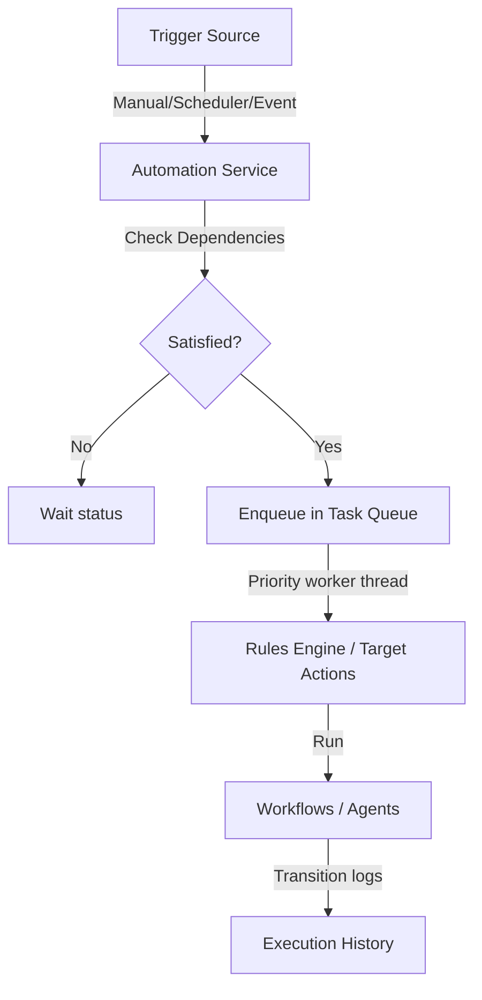

# AI Automation & Task Execution Framework

This document outlines the design and operational procedures of the AI Automation & Task Execution framework inside the DK AI Ecosystem.

## Architectural Overview

The automation framework consists of:
1. **Automation Service**: Central facade coordinating job life-cycle states, registration, and run executions.
2. **Priority Task Queue**: Background thread queue orchestrating execution tasks based on normal/priority weights.
3. **Scheduler Service**: Abstraction wrapper utilizing APScheduler for time-based triggers.
4. **Event Listener**: Ecosystem pub-sub coordinator matching event signals to active jobs.
5. **Rules Engine**: Conditional IF-THEN-ELSE evaluator for branching executions.

## REST API Endpoints

- `GET /api/v1/automation/jobs`: List registered jobs.
- `POST /api/v1/automation/jobs`: Register a new job.
- `GET /api/v1/automation/jobs/{id}/progress`: Query live percent progress.
- `GET /api/v1/automation/dashboard`: Retrieve dashboard metrics.
- `POST /api/v1/automation/webhook`: Receive incoming trigger webhooks.
